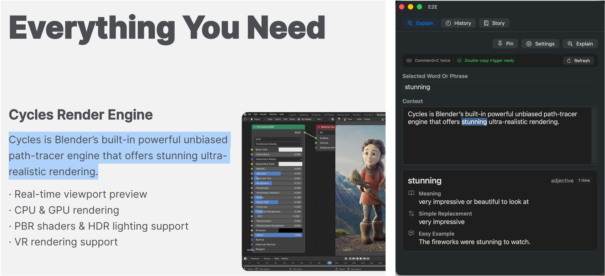

# E2E

**中文** | [English](README.en.md)

E2E 是一个 macOS 英语阅读小工具。它的核心想法是 **English Explain English**：不用中文翻译英文，而是用简单英语解释一个词或短语在当前语境里的意思。

你先选中一整句或一小段上下文，再在 E2E 里选中不懂的词。E2E 会根据这段上下文解释这个词，而不是给出脱离语境的字典义。



## 适合谁

- 读英文论文、文档、邮件、网页时，经常被单词或短语卡住的人。
- 想用英语理解英语，而不是每次都翻译成中文的人。
- 希望保存生词历史，并用历史词汇生成短文练习的人。

## 直接下载

普通用户请直接下载 App，不需要安装 Xcode，也不需要自己编译。

1. 打开最新版下载页：<https://github.com/zhonghaoyi/E2E/releases/latest>
2. 下载 `E2E-macOS-0.1.1.zip`
3. 解压
4. 把 `E2E.app` 拖到 `Applications` 文件夹
5. 打开 `E2E.app`

当前开源包还没有 Apple 公证。第一次打开时，macOS 可能提示“无法验证开发者”。如果出现这个提示：

1. 右键点击 `E2E.app`
2. 选择 `Open`
3. 在弹窗里再次点击 `Open`

如果弹窗只显示 `Done` 和 `Move to Bin`：

1. 点击 `Done`
2. 打开 `System Settings`
3. 进入 `Privacy & Security`
4. 滚动到 `Security`
5. 找到关于 `E2E` 被阻止的提示
6. 点击 `Open Anyway`

如果你熟悉 Terminal，也可以运行：

```bash
xattr -dr com.apple.quarantine /Applications/E2E.app
```

第一次打开后，后面通常就可以正常打开了。

## 你需要准备什么

- macOS 14 或更新版本
- 一个 OpenRouter API key 或 OpenAI API key

API key 由用户自己填写。E2E 不内置任何 API key。

API key 获取入口：

- OpenAI：[platform.openai.com/api-keys](https://platform.openai.com/api-keys)
- OpenRouter：[openrouter.ai/settings/credits](https://openrouter.ai/settings/credits)

## 第一次设置

1. 打开 E2E
2. 点击 `Settings`
3. 选择 `OpenRouter` 或 `OpenAI`
4. 粘贴你的 API key
5. 点击 `Refresh` 加载模型列表
6. 选择一个模型
7. 点击 `Test`
8. 点击 `Save`

你的 API key 会保存在 macOS Keychain 里，不会写入 App 文件、GitHub 仓库或 history 文件。

## 如何使用

1. 在论文、网页、PDF、邮件或其他 App 里，选中包含目标词的一整句或一小段。
2. 连续按两次 `Command+C`。
3. E2E 会把这段文字放进 `Context` 区域。
4. 在 E2E 的 `Context` 区域里，用鼠标选中你真正不懂的词或短语。
5. 点击 `Explain`。

E2E 会显示：

- 这个词在当前语境里的意思
- 更简单的替代表达
- 一个简单例句
- 当前词性
- 历史出现次数

## History

E2E 会在本地保存解释历史，方便你复习。

默认路径：

```text
~/Library/Application Support/E2E/history.json
```

你也可以在 Settings 里自定义 history 文件路径，比如保存到云盘目录。history 是本地 JSON 文件，App 不会主动上传它。

## Story

`Story` 页面可以从你的 history 里随机选词，生成一段尽量短、尽量简单的英文短文。

你可以按这些条件筛选词汇：

- 时间范围：1 天、1 周、1 个月、3 个月
- 出现次数：全部、1 次、大于 3 次、大于 7 次
- 词汇数量上限：10、30、50、70、100

短文里的 history 词汇会被高亮，点击可以跳回对应的 history 记录。你也可以点击中文翻译按钮，用来检查自己是否理解正确。

## 隐私说明

E2E 尽量保持本地优先：

- API key 存在 macOS Keychain。
- 设置存在 macOS UserDefaults。
- history 存在本地 JSON 文件。
- 只有当你点击 `Explain` 或生成 Story 时，选中的文本才会发送给你选择的 LLM 服务商。
- App 不包含任何内置 API key。

## 开发者

如果你想自己编译或改代码，请看：[从源码安装](docs/install-from-source.md)。

## License

MIT License. See [LICENSE](LICENSE).
